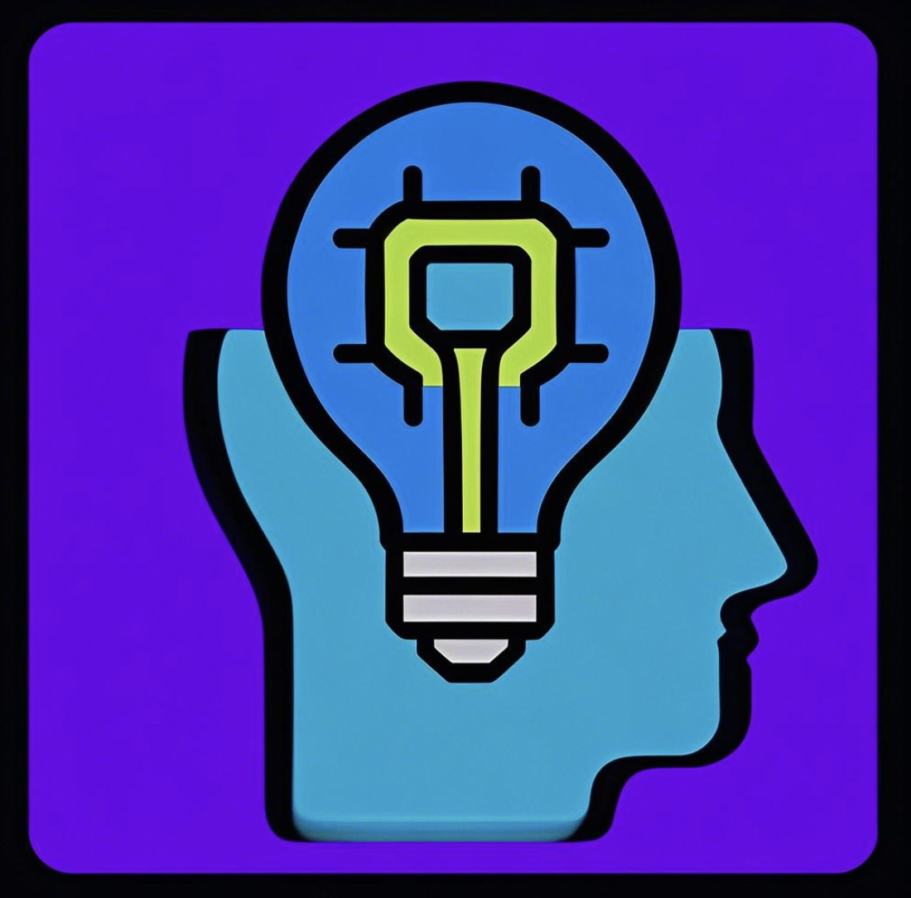

Check out the configuration reference at https://huggingface.co/docs/hub/spaces-config-reference

# SoulForge: Advanced Digital Life & Metaverse Pioneer

<p align="center">
  
</p>

## 🌟 Vision

SoulForge is revolutionizing digital life creation through cutting-edge AI and blockchain technology. We're building the foundation of the future metaverse with highly autonomous digital beings.

## 🚀 Key Innovations

- **Rapid Digital Life Generation**: Create digital humans in 3-5 minutes from just 15-60 seconds of video
- **Autonomous Unmanned Livestreaming**: AI-driven fully automated livestreaming system
- **Real Scene Integration**: Seamlessly embed digital life into real-world environments
- **Decentralized Ownership**: True digital life ownership through NFTs
- **Metaverse Infrastructure**: Foundation for a new digital society

## 💫 Technology Showcase

SoulForge leverages the power of wav2lip model along with our proprietary enhancements to create lifelike digital avatars with unprecedented realism:

```python
import torch
from models.wav2lip import Wav2Lip
import audio
import face_detection
import numpy as np

class SoulForgeDigitalLifeGenerator:
    def __init__(self, checkpoint_path='checkpoints/wav2lip_gan.pth'):
        self.device = 'cuda' if torch.cuda.is_available() else 'cpu'
        self.model = self._load_model(checkpoint_path)
        self.face_detector = face_detection.FaceAlignment(face_detection.LandmarksType._2D, 
                                                          device=self.device)
    
    def _load_model(self, path):
        model = Wav2Lip()
        checkpoint = torch.load(path)
        s = checkpoint["state_dict"]
        model.load_state_dict(s)
        model = model.to(self.device)
        return model.eval()
    
    def generate_digital_life(self, face_video_path, audio_path, output_path):
        # Process face video frames
        face_frames = self._extract_and_preprocess_face_frames(face_video_path)
        
        # Process audio
        mel = audio.load_mel(audio_path)
        
        # Generate synced video
        result_frames = self._generate_lip_sync(face_frames, mel)
        
        # Post-processing for enhanced realism
        enhanced_frames = self._apply_soulforge_enhancements(result_frames)
        
        # Save to output
        self._save_video(enhanced_frames, audio_path, output_path)
        
        return output_path
```

Our autonomous livestreaming system utilizes advanced AI for content generation:

```javascript
class LivestreamManager {
  constructor(digitalLifeId, platformConnectors) {
    this.digitalLife = DigitalLifeRegistry.get(digitalLifeId);
    this.platforms = platformConnectors || [];
    this.contentGenerator = new ContentGenerator(this.digitalLife.personality);
    this.responseHandler = new ResponseHandler(this.digitalLife);
  }

  async startLivestream(topic, duration) {
    const stream = await this.setupStream();
    
    // Initialize topic-based content plan
    const contentPlan = await this.contentGenerator.createContentPlan(topic, duration);
    
    // Start broadcasting to all connected platforms
    for (const platform of this.platforms) {
      await platform.startBroadcast(stream);
    }
    
    // Begin autonomous content delivery
    this.contentDeliveryLoop = setInterval(() => {
      const nextContent = contentPlan.getNextSegment();
      if (nextContent) {
        this.broadcastContent(nextContent);
      } else {
        this.endLivestream();
      }
    }, 30000); // Check for new content every 30 seconds
    
    // Initialize real-time interaction handler
    this.activateInteractionHandler();
  }
  
  // Additional methods omitted for brevity
}
```

## 🔗 Blockchain Integration

SoulForge is built on the Solana blockchain, utilizing smart contracts for NFT minting and ownership:

```solidity
// SoulForgeNFT.sol
// SPDX-License-Identifier: MIT
pragma solidity ^0.8.0;

import "@openzeppelin/contracts/token/ERC721/extensions/ERC721URIStorage.sol";
import "@openzeppelin/contracts/access/Ownable.sol";

contract SoulForgeNFT is ERC721URIStorage, Ownable {
    uint256 private _tokenIds;
    
    // Fee structure
    uint256 public creationFee;
    
    // Fee distribution
    uint256 public constant ECOSYSTEM_SHARE = 70;
    uint256 public constant BURN_SHARE = 30;
    
    event DigitalLifeCreated(uint256 tokenId, address creator, string metadataURI);
    
    constructor() ERC721("SoulForge Digital Life", "SOUL") {
        creationFee = 0.1 ether; // Initial fee
    }
    
    function createDigitalLife(string memory metadataURI) public payable returns (uint256) {
        require(msg.value >= creationFee, "Insufficient creation fee");
        
        _tokenIds++;
        uint256 newTokenId = _tokenIds;
        
        _mint(msg.sender, newTokenId);
        _setTokenURI(newTokenId, metadataURI);
        
        // Distribute fees
        uint256 ecosystemAmount = (msg.value * ECOSYSTEM_SHARE) / 100;
        uint256 burnAmount = msg.value - ecosystemAmount;
        
        // Send to ecosystem fund
        payable(owner()).transfer(ecosystemAmount);
        
        // Rest is effectively burned by keeping in contract
        
        emit DigitalLifeCreated(newTokenId, msg.sender, metadataURI);
        
        return newTokenId;
    }
    
    // Additional functions omitted for brevity
}
```

## 💎 Token Economics

- **$FORGE Token**: 1 billion total supply
- **Fair Launch**: 100% fair launch on Solana blockchain
- **Utility**: Creation fees, feature unlocking, governance

## 🗺️ Roadmap

| Phase | Timeline | Focus |
|-------|----------|-------|
| 1 | 2024 Q3-Q4 | Core tech, NFT minting system, wallet integration |
| 2 | 2025 Q1-Q2 | Digital life platform launch, NFT marketplace |
| 3 | 2025 Q3-Q4 | Multi-scenario applications, metaverse foundation |
| 4 | 2026+ | First decentralized digital life community |

## 🤝 Join the Revolution

- [Website](http://soulforge.online)
- [Twitter](https://x.com/SoulForge_AI)

## 📜 License

Copyright © 2024 SoulForge